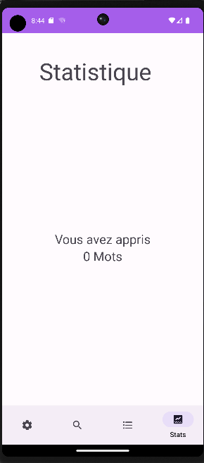

# PCM-PROJET-2022

- William Benakli 
- David Saad 

## LearnDico

LearnDico est une application de langue qui aide les utilisateurs à améliorer leurs compétences linguistiques.
Notre interface graphique utilise principalement des fragments pour la navigation, ce qui améliore l'expérience utilisateur et rend l'application plus agréable visuellement.

# Permission
Il est recommandé d'accepter les permissions et les droits demandés pour l'appareil afin de mieux naviguer dans l'application.

### Notre interface graphique 

### Page d'accueil
La page d'accueil est la page principale de l'application. 

### Page de parametre
La page de paramètres permet aux utilisateurs de personnaliser leur expérience dans l'application.

### Page des mots 
La page de mots permet aux utilisateurs de visualiser et apprendre de nouveaux mots

### Page des dictionnaires
La page de dictionnaires leur permet d'accéder et de sélectionner parmi une variété de dictionnaires.

### Page des statistiques
 La page de statistiques leur fournit des informations sur leur progression.

## Fonctionnalité

Nous avons implémentés toutes les fonctionnalités de base demander. L'utilisateur peut donc ajouter des dictionnaires par le biais de mots. Recevoir des notifications concernant les mots à apprendre. Avoir son propre moteur de recherche. Une sélection de dictionnaires autant que possible. Le choix d'ajouter ses propres langues etc....

### Extensions utiles du projet

- Utilisation des fragments
- Téléchargement des pages web
